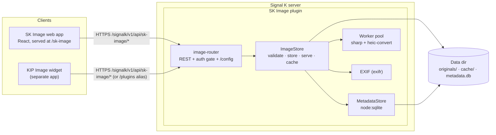

# Architecture overview

SK Image is a **Signal K server plugin** written in TypeScript. It stores a shared, boat-wide image library and serves it back on demand: secure upload, EXIF extraction, on-the-fly resize and re-encode to WebP, a size-capped on-disk cache, and collections. This page is the map — how the pieces fit and where each concern lives. Once you can see the shape, the rest of the developer docs each zoom into one flow.

> **New contributor? Start here.** None of this assumes you've built a Signal K plugin before. Read this page top to bottom, then follow the cross-links at the end into whichever flow you're changing. The plugin entry point is `src/index.ts`; almost everything else is a small module it composes.

---

## Component map

---

## What falls out of this

A few things are load-bearing once you can see the diagram:

- **Bytes live on disk; facts about them live in SQLite.** The image data — originals and generated WebP variants — sits in the data dir under `originals/` and `cache/`. Everything you'd want to _query_ (id, filename, dimensions, capture date, GPS, camera make/model, collection membership) lives in `metadata.db` via `MetadataStore`. That split is why the database is disposable: it's a derived index over the originals, so a lost or corrupt `metadata.db` is quarantined and replaced with a fresh index on the next start rather than taking routes offline, and the originals are never at risk from a database problem.

- **The web app and the KIP widget are just HTTP clients.** Neither is special. They both talk to the same REST route table, authenticate with the same Signal K session, and get the same WebP bytes back. The plugin has no idea which one is calling. If you can do it in the web app, you can do it with `curl`.

- **The same routes are published on two mounts.** `registerImageRoutes` takes a `basePath`, so the route table is mounted twice: at `/signalk/v1/api/sk-image` (via `signalKApiRoutes`) and at `/plugins/sk-image` (via `registerWithRouter`). The first is _not_ admin-gated by a secured server, so ordinary crew can reach the library there — the second is a backward-compatible alias that a secured server admin-gates. The web app targets the crew-reachable path. A third, read-only projection of the metadata is published as the v2 `images` resource type (`image-resources.ts`). See [Security model → access model](security-model.md#access-model--the-three-mounts).

- **The worker pool keeps the server thread responsive.** Decoding a HEIC, resizing a 12-megapixel photo, and re-encoding it to WebP is CPU-heavy. `ImageStore` hands that work to a pool of worker threads (`sharp`, plus `heic-convert` for HEIC/HEIF) instead of blocking the Node event loop, so serving one large image doesn't stall every other Signal K request. Results are written to the on-disk cache so the expensive work happens once per `(image, width)` pair.

- **Originals are never served raw.** Every raster request is re-encoded to WebP at a snapped width before it goes out; SVG is sanitized on upload and served as vector. `ImageStore` is the only module that reads or writes the byte stores, so those invariants have exactly one home.

---

## Subsystems

Each concern is a small module the entry point composes. If you're changing behavior, this table tells you which file to open.

| Concern | Where | File |
| --- | --- | --- |
| Plugin lifecycle — `start`/`stop`, schema, wiring, KIP `requiredPlugins` hook | Plugin entry | `src/index.ts` |
| REST routes, the auth gate on upload/delete/purge, and `GET /config` | Router | `src/images/image-router.ts` |
| Validate, store, serve, and cache images; the one owner of the byte stores | Core | `src/images/image-store.ts` |
| Image records, queries, collections; `node:sqlite`; quarantine + rebuild | Metadata | `src/images/metadata-store.ts` |
| Resize / re-encode to WebP; HEIC decode; off-thread CPU work | Processing | `src/images/image-processing.ts`, `worker-pool.ts`, `image-worker.ts` |
| Pull capture date, GPS, camera make/model, orientation from originals | EXIF | `src/images/exif.ts` |
| The React front-end served at `/sk-image` (Library, Collections, Settings) | Web app | `webapp/` |

> **Note:** `ImageStore` is the choke point on purpose. Routing, metadata, processing, and EXIF all fan out from it, and it's the only module that touches `originals/` and `cache/` on disk. Keep new byte-level logic there rather than reaching into the data dir from a route handler.

---

## How to read the rest of the docs

- **How a request turns into pixels** — upload, validate, store, and the serve-and-cache path → [Request flows](request-flows.md)
- **Where bytes and metadata live** — the data dir layout, the SQLite schema, cache eviction, and rebuild-on-corruption → [Storage and data](storage-and-data.md)
- **What every change must keep true** — content sniffing, always-re-encode, SVG sanitizing, the auth gate, and response hardening → [Security model](security-model.md)
- **How KIP pulls the plugin in** — `requiredPlugins`, App Store auto-install, and the restart prompt → [Auto-install](auto-install.md)
- **The exact endpoints** — every route, parameter, and status code → [HTTP API](../reference/http-api.md)
