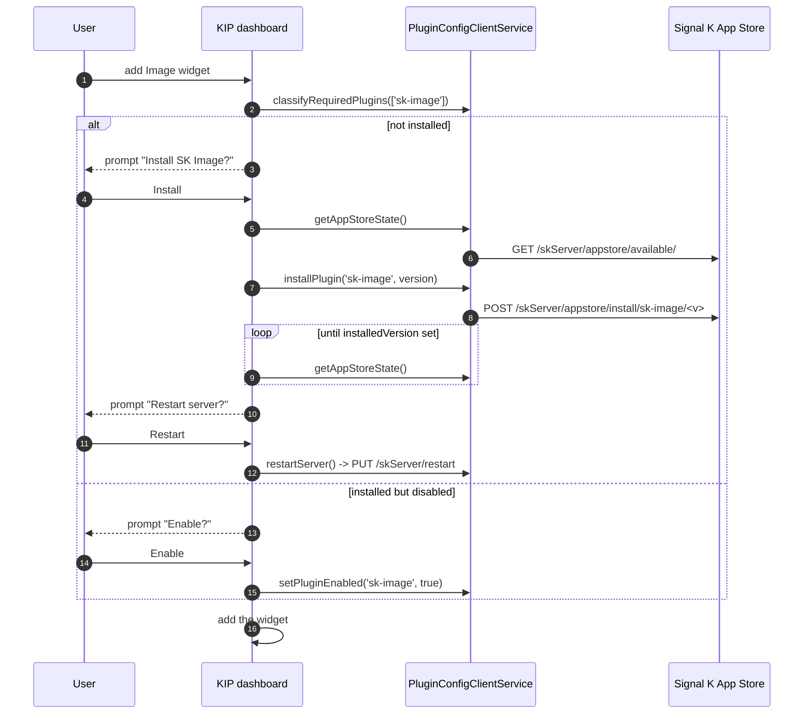

# Widget auto-install (KIP side)

The KIP **Image** widget depends on this plugin. To keep that dependency from becoming a manual setup chore, KIP declares `requiredPlugins: ['sk-image']` on the widget and resolves it when the widget is added to a dashboard. This doc lives in the sk-image repo but documents the KIP-side flow, so you can see exactly what KIP asks of a Signal K server and where the boundaries are.

> **Start here.** KIP can _install_ and _enable_ the plugin for the user, but it can never make a freshly installed plugin start serving in the current process. The Signal K server only loads new plugin code on a restart, so the restart is always a user-confirmed step, never something KIP does silently.

---

## What KIP does when the widget is added

When the user drops an **Image** widget onto a dashboard, KIP classifies the required plugin into one of three states and acts on it:

- **Installed and enabled** — nothing to do; KIP just adds the widget.
- **Not installed** — KIP offers to install `sk-image` from the Signal K App Store, polls until the install lands, then prompts for a server restart.
- **Installed but disabled** — KIP offers to enable it (no restart needed for enable-only).

What falls out of this: the widget stays declarative about its needs (`requiredPlugins`), and all the awkward server-management work — reading App Store state, kicking off an install, waiting, restarting — is centralized in one KIP service instead of being scattered through widget code.

---

## The App Store endpoints

KIP talks to the Signal K server's built-in App Store admin API. Three endpoints carry the flow:

- `GET /skServer/appstore/available/` — the catalog plus per-plugin state. KIP reads this to learn whether `sk-image` is installed, which version is available, and the `storeAvailable` flag (see below). It also polls this endpoint after an install to watch for `installedVersion` becoming set.
- `POST /skServer/appstore/install/sk-image/<v>` — install a specific version. KIP passes the version it read from the available catalog.
- `PUT /skServer/restart` — restart the server so the newly installed plugin actually loads.

Install and restart are privileged operations: they need an authenticated **admin** login on the Signal K server _and_ internet access on the server host, because the App Store fetches the package from the network on first install. Read-only classification (is it installed? is it enabled?) does not need internet.

> **Note:** KIP enabling or installing the plugin changes the server's on-disk config, but the _running_ Signal K process only loads the newly installed plugin after a restart. That is why the restart prompt exists and why it is user-confirmed — KIP will not restart the server out from under connected clients on its own.

---

## Degraded paths

Two conditions change what KIP offers:

- **Store offline (`storeAvailable` is false)** — the server reports it cannot reach the App Store (no internet, or the store is down). KIP degrades gracefully: it does not offer an install it can't complete, and instead tells the user the plugin is required but the store is unavailable.
- **Not an admin** — the signed-in Signal K principal lacks admin rights. Install, enable, and restart all require admin, so KIP surfaces a message that an admin must install or enable `sk-image` rather than showing an action the request would reject.

In both cases the widget can still be added; it just renders its "plugin required" state until the dependency is satisfied.

---

## Where this lives in KIP

Two files carry the flow. Both are in the KIP repo, not here:

- `src/app/core/services/plugin-config-client.service.ts` — the server-facing client. It owns `getAppStoreState()` (reads `/skServer/appstore/available/`), `installPlugin('sk-image', version)` (posts to the install endpoint), `setPluginEnabled('sk-image', true)`, and `restartServer()` (`PUT /skServer/restart`).
- `src/app/core/components/dashboard/dashboard.component.ts` — the orchestration. It runs `classifyRequiredPlugins(['sk-image'])` when a widget is added and drives the install/enable/restart prompts, calling into the service above.

---

## Where to next

- [The KIP Image widget](../guides/the-kip-widget.md)
- [HTTP API](../reference/http-api.md)
- [Configuration](../reference/configuration.md)
