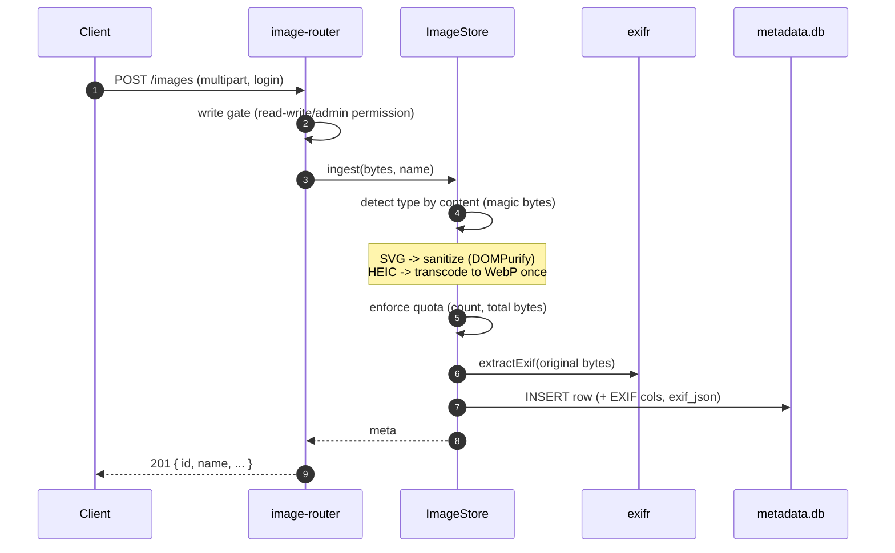

# Request flows

This doc traces the two hot paths through the plugin: taking an upload in and serving a sized variant back out. Both flows live behind the routes in `src/images/image-router.ts` and hand off to `src/images/image-store.ts` for the real work.

> **Start here.** Read the two sequence diagrams below before touching upload or serve code. They show where auth runs, where content sniffing and quota checks happen, and where the on-disk cache sits — the same decision points you will keep re-deriving from the source otherwise.

---

## Upload

An upload is a single `POST /images` with a `multipart/form-data` body. The router runs the auth gate, then `ImageStore` owns the rest: it decides the type from the bytes (never the filename or client MIME), normalizes anything that needs it, checks the library quotas, pulls EXIF, and writes one metadata row.



A few things to hold onto from this path:

- **Content decides the type, not the request.** The detected magic bytes drive everything downstream; the client-supplied filename is kept only as display metadata and the on-disk name is a generated UUID.
- **Two formats are normalized on the way in.** SVG is sanitized with DOMPurify so served vectors can't carry active content, and HEIC/HEIF is transcoded to WebP once at ingest rather than on every serve.
- **Quotas are enforced before the write.** `ImageStore` checks both the image count and the total original bytes against the library caps, so a request that would push the library over budget is rejected before anything lands in `metadata.db`.
- **EXIF is read from the original bytes.** `exifr` pulls capture date, GPS, camera make/model, and orientation into dedicated columns, with the full raw tag set stored alongside as `exif_json`.

---

## Serve a variant (with cache)

A serve is `GET /images/:id?w=<width>`. The router asks `ImageStore` for a servable variant; the store snaps the requested width to the allow-list, checks the on-disk cache, and only spins up a worker on a miss.

```mermaid
sequenceDiagram
  autonumber
  participant C as Client
  participant R as image-router
  participant S as ImageStore
  participant W as Worker (sharp)
  C->>R: GET /images/:id?w=640
  R->>S: getServable(id, 640)
  S->>S: snap width to 640; look for cache/<id>/640.webp
  alt cache hit
    S-->>R: cached WebP
  else miss
    S->>W: resize + re-encode to WebP
    W-->>S: bytes
    S->>S: write cache, record LRU, evict if over budget
    S-->>R: WebP
  end
  R-->>C: 200 image/webp (immutable cache headers)
```

What falls out of this path:

- **Widths snap to a fixed allow-list.** The requested `w` is rounded up to the nearest of `[160, 320, 640, 960, 1280, 1920, 2560]` (omit it for the largest). That bounds the number of distinct variants, which keeps the cache small and every response's URL stable enough to send `immutable` cache headers.
- **Concurrent identical requests are coalesced.** If two clients ask for the same `id`/width while it is still being generated, `ImageStore` does the resize once and both requests wait on the single in-flight job — you don't get duplicate `sharp` work or a torn cache write for the same variant.
- **Originals are never served raw.** Every raster response is a freshly re-encoded WebP produced by a `sharp` worker; the original bytes stay on disk and are only ever read to regenerate a variant. See [Security model](security-model.md) for why this matters.
- **The cache is LRU with a budget.** After a miss, the store writes `cache/<id>/<width>.webp`, records it in the LRU, and evicts least-recently-used variants if the total is over the configured budget. A purge removes generated variants only; originals stay and regenerate on demand.

The `sharp` work runs off the event loop in a worker pool — see `src/images/worker-pool.ts` for how jobs are queued and how the pool is sized. The routing and cache-header logic is in `src/images/image-router.ts`, and the snap/cache/coalesce/evict logic is in `src/images/image-store.ts`.

---

## Where to next

- [Storage and data](storage-and-data.md) — where originals, cached variants, and `metadata.db` live on disk, and how a corrupt DB is quarantined rather than taking routes offline.
- [Security model](security-model.md) — content sniffing, SVG sanitizing, re-encode-on-serve, and the auth gate on mutating routes.
