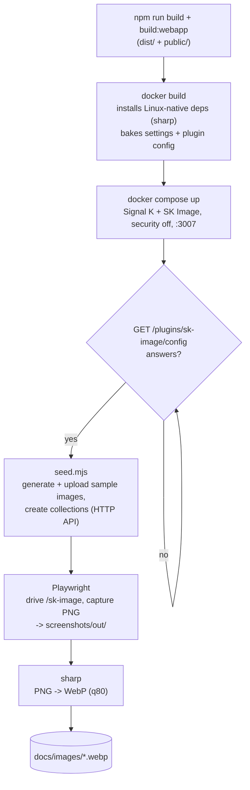

# Documentation screenshots

The screenshots in these docs are **generated, not hand-taken**. A single command spins up a real Signal K server with SK Image installed, seeds it with synthetic sample data, drives the web app with Playwright, and writes fresh WebP images into `docs/images/`. That keeps the pictures in the guides honest — they always reflect the current UI — and reproducible by anyone, on any machine with Docker.

> **Start here.** Everything lives in the `e2e/` directory. To refresh every screenshot: `cd e2e && ./capture.sh`. Stop the stack afterwards with `./capture.sh --down`. You do not need a local Node 22.13 or a configured Signal K server — the Docker image carries all of that.

---

## The pipeline



`capture.sh` runs those steps in order and is safe to re-run; the seed is idempotent (it skips if the library already has images), and each run overwrites the published WebP files.

---

## Why a Docker harness

- **Native dependencies.** SK Image depends on `sharp`, whose binary is platform-specific. You can't mount a macOS `node_modules` into a Linux container, so the `e2e/Dockerfile` copies the built `dist/` + `public/` into a `signalk/signalk-server` image and runs `npm install --omit=dev --ignore-scripts` **inside** the container, fetching the right Linux binary. `--ignore-scripts` also mirrors how the Signal K App Store installs plugins.
- **A turnkey server.** The image bakes a `settings.json` (security off, a scrubbed `Test Vessel`) and a `plugin-config-data/sk-image.json` (plugin enabled) so the server boots ready to use, with no interactive setup. Config is baked into the image rather than bind-mounted, so the mount can't shadow the plugin the Dockerfile installed.
- **No secrets, no PII.** The seed generates its images from scratch with `sharp` — dark technical "diagrams" and gradient "photos" — and the photo files carry only synthetic EXIF (a made-up camera make/model and capture date). Nothing real about any boat, person, or position appears in the fixtures.

---

## What gets captured

`e2e/screenshots/webapp.spec.ts` captures four views of the web app:

| Shot           | View                              | File                            |
| -------------- | --------------------------------- | ------------------------------- |
| `library`      | the Library grid                  | `docs/images/library.webp`      |
| `image-detail` | the image detail drawer with EXIF | `docs/images/image-detail.webp` |
| `collections`  | the Collections manager           | `docs/images/collections.webp`  |
| `settings`     | the image-cache card              | `docs/images/settings.webp`     |

Playwright emits PNG; `e2e/scripts/to-webp.mjs` converts the curated set to WebP with `sharp` and copies them into `docs/images/`. Only the names listed in that script's `PUBLISH` array are published.

### Adding a screenshot

1. Add a `test(...)` to `e2e/screenshots/webapp.spec.ts` that navigates to the view and calls `shot(page, 'my-name')` (optionally with a CSS selector to clip to one element).
2. Add `'my-name'` to the `PUBLISH` array in `e2e/scripts/to-webp.mjs`.
3. Reference `../images/my-name.webp` from a doc.
4. Re-run `./capture.sh`.

---

## The KIP widget screenshot

One image — the KIP **Image** widget's configuration dialog (`kip-widget-config.webp`) — comes from a different app. KIP is a separate Signal K dashboard that hosts an Image widget backed by this plugin, so capturing its config UI means driving KIP, not the SK Image web app. It runs as its own flow and needs a KIP checkout that ships the Image widget (`requiredPlugins: ['sk-image']`):

```bash
KIP_DIR=/path/to/kip ./capture-kip.sh
```

`capture-kip.sh` brings up the same Docker SK Image server and seeds it, builds and statically serves the KIP app (`kip/serve-kip.mjs`), then drives KIP with Playwright (`kip/capture-kip.mjs`): it injects a KIP config that points at the SK Image server with one Image widget pre-placed, opens that widget's options dialog, and writes `docs/images/kip-widget-config.webp`. KIP and the server run on different origins, so this relies on the server's permissive local CORS (security is off in the harness).

---

## Files

| File | Role |
| --- | --- |
| `e2e/capture.sh` | orchestrates the whole run (`--down` to tear down) |
| `e2e/Dockerfile` | Signal K server image with the plugin + its Linux deps + baked config |
| `e2e/docker-compose.yml` | builds and runs the stack (security off, port `3007`) |
| `e2e/signalk-config/` | the baked `settings.json` + `plugin-config-data/sk-image.json` |
| `e2e/seed.mjs` | generates + uploads sample images and collections over the HTTP API |
| `e2e/screenshots.config.ts` | Playwright config (Chromium, retina, deterministic viewport) |
| `e2e/screenshots/webapp.spec.ts` | the capture specs |
| `e2e/screenshots/harness.ts` | the `shot()` helper |
| `e2e/scripts/to-webp.mjs` | PNG → WebP conversion into `docs/images/` |
| `e2e/capture-kip.sh` | captures the KIP Image-widget config screenshot (needs a KIP checkout) |
| `e2e/kip/serve-kip.mjs` | static server for a built KIP app |
| `e2e/kip/capture-kip.mjs` | Playwright capture of the KIP widget config dialog |

See [`e2e/README.md`](../../e2e/README.md) for the operational details and troubleshooting.

---

## Where to next

- [Architecture overview](architecture.md) — what the screenshots are showing under the hood.
- [The app](../guides/the-app.md) — the user-facing tour these images illustrate.
