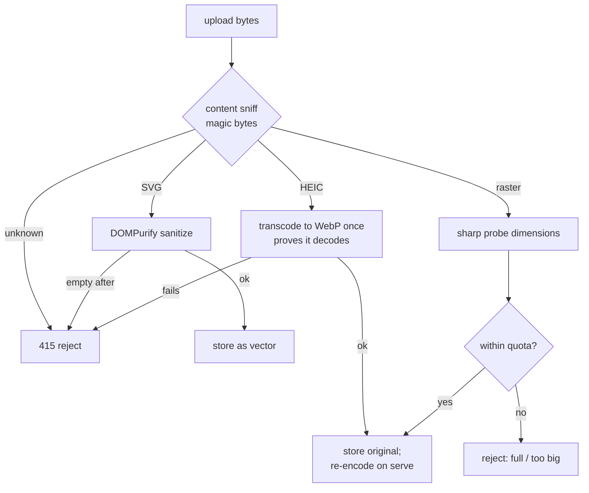

# Security model

SK Image accepts untrusted files and serves them back into everyone's browser. It runs unattended on a shared boat: any crew member with an account can upload, and everyone else views the result. An uploaded file is never trusted for what it claims to be — a `.jpg` might be an HTML page, a PNG might be a polyglot, an SVG might carry a `<script>`. This page is the contract: **the invariants every change must keep**, and the mechanisms in `src/images/image-store.ts` and `src/images/image-router.ts` that enforce them.

> **Reviewing a PR? This is your checklist.** A new route, format, or serve path that breaks one of these is a security regression even if every test still passes:
>
> 1. **Type is decided by a content sniff of the bytes — never the filename or the client's `Content-Type`.** The extension and MIME header are display data at most; they never pick a code path.
> 2. **Raster originals are never served raw.** Everything raster goes back out re-encoded to WebP; the stored original bytes are never streamed to a browser.
> 3. **SVG is sanitized on ingest with DOMPurify.** Scripts, event handlers, and external references are stripped before it's stored; what's on disk is already safe to serve.
> 4. **On-disk names are generated UUIDs.** The client filename is kept only as display metadata — it never touches a filesystem path.
> 5. **Upload, delete, and purge require read-write or admin permission** when the server has security enabled — an authenticated _read-only_ principal (including the anonymous one the server attaches under "Allow Readonly Access") is rejected.
> 6. **Served images carry `X-Content-Type-Options: nosniff` and a strict CSP,** so a browser can't be tricked into re-interpreting a response.

---

## The ingest gate

Every upload runs the same validation before a single byte is persisted. The decision is driven entirely by the leading **magic bytes**, not by anything the client asserts.

What falls out of this shape:

- **Unknown means rejected, not guessed.** If the sniff doesn't recognize the bytes, the upload is refused with `415` — there is no "trust the extension" fallback.
- **SVG can't survive ingest with anything executable in it.** DOMPurify runs before storage, and if sanitizing leaves nothing, the upload is rejected rather than stored empty. The file on disk is already the sanitized vector, so the serve path has nothing left to clean up.
- **HEIC has to prove it decodes.** It's transcoded to WebP once at ingest; a file that only pretends to be HEIC fails that transcode and is rejected before it's ever stored.
- **Raster is bounded before it's kept.** `sharp` probes the real dimensions, and the library quota (image count and total bytes of originals) is checked before the original is written. The original is stored, but every request for it re-encodes to WebP on the way out.

---

## Other mechanisms at a glance

| Concern | Mechanism | File |
| --- | --- | --- |
| Spoofed type / polyglot upload | content sniff on magic bytes; filename and `Content-Type` are never trusted | `src/images/image-store.ts` |
| Executable raster tricks on serve | raster originals never served raw; always re-encoded to WebP with a snapped width | `src/images/image-store.ts` |
| Active content in SVG | DOMPurify sanitize on ingest; scripts, handlers, and external refs stripped | `src/images/image-store.ts` |
| Browser MIME re-sniffing | `X-Content-Type-Options: nosniff` + strict CSP on every image response | `src/images/image-router.ts` |
| Path traversal via client filename | on-disk names are generated UUIDs; the client filename is stored only as display metadata | `src/images/image-store.ts` |
| Unauthenticated mutation | upload / delete / cache-purge require read-write or admin permission when server security is on | `src/images/sk-request.ts` |
| Disk / memory exhaustion | max upload size + library caps (image count and total originals) enforced at ingest | `src/images/image-store.ts` |

---

## Known residual notes

- **The server admin-gates plugin routes; the plugin's checks are defense-in-depth.** When security is enabled, signalk-server fronts every `/plugins/*` route with an **admin-only** guard (`app.use('/plugins', adminAuthenticationMiddleware)` in `tokensecurity.ts`), so a non-admin — read-only, read-write, or anonymous — gets `401` from the _server_ before this plugin's router runs. Only an `admin` principal reaches the plugin, and admins always have write permission. So the in-handler check (`isAuthorizedWriter`: read-write/admin only, rejecting the anonymous `AUTO`/readonly principal) is the _effective_ write gate only on an **unsecured** server (no `/plugins` middleware); on a secured server it is a redundant belt. **Net: with security enabled, sk-image is effectively admin-only.** _(Verified against signalk-server ≥ 2.30.0; the `e2e/auth` matrix pins this behavior.)_
- **Reads are shared only on an unsecured server.** On an unsecured server the library is shared across the boat — anyone can list and view images, so capture GPS is treated as sensitive: `lat`/`lon` are stripped from the listing and `GET /images/:id/exif` requires a logged-in user (`canReadSensitiveMetadata`). On a **secured** server the admin gate above means only admins can read at all, so that GPS/EXIF handling never actually triggers. If a future change moves reads onto the Signal K data model / a resource path (which is _not_ admin-gated), non-admin crew could view again — and then the location-scrubbing would matter. If you add a route that exposes per-image metadata, gate location the same way; if it mutates state, gate it for write access.
- **Sanitizing depends on the sniff being right first.** SVG is only sanitized because it was sniffed as SVG. Anything that would let a non-SVG code path serve raw stored bytes would route around DOMPurify — which is why invariant (2), "raster originals are never served raw," is load-bearing for the SVG story too.

---

## Where to next

- [Storage and data](storage-and-data.md) — where originals, cache variants, and metadata live, and how a corrupt index is quarantined.
- [HTTP API](../reference/http-api.md) — the routes these invariants gate.
- [Configuration](../reference/configuration.md) — the cache budget and how purge relates to it.
