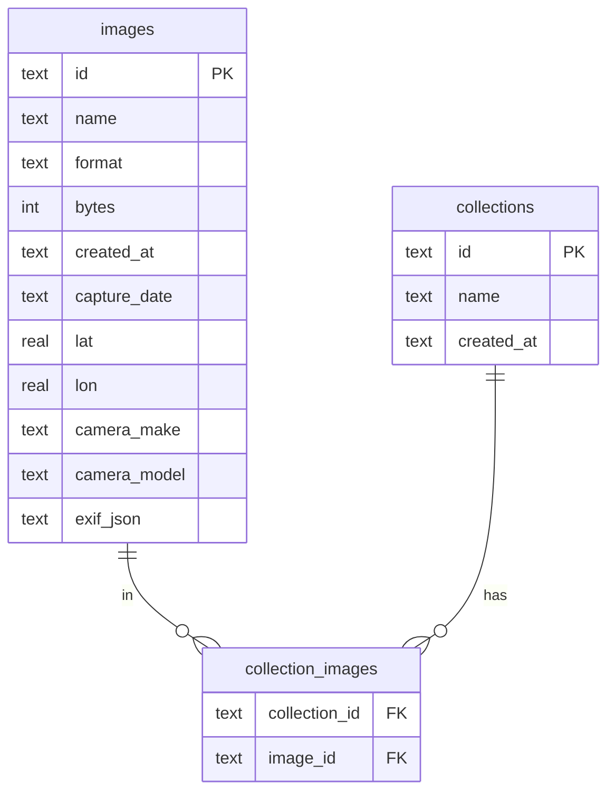

# Storage & data model

SK Image keeps two kinds of state, and it keeps them apart on purpose. The image **bytes** live as plain files on disk. The **metadata** — names, formats, capture dates, GPS, camera, EXIF, collections — lives in a small SQLite database. The database is only an index over the bytes, never the source of truth: it can be thrown away and rebuilt from the originals at any time.

> **Start here.** The originals are the truth. `metadata.db` and everything under `cache/` are derived — an index and a re-encode cache. A purged or missing `cache/` refills on demand, and a corrupt `metadata.db` is quarantined and replaced with a fresh index rather than taking the plugin offline. Nothing a user uploaded is ever stored _only_ in the database — the originals carry every fact the index holds (except which collections an image belongs to, which lives only in the DB).

The pieces live in `src/images/metadata-store.ts` (the SQLite index, backed by the built-in `node:sqlite`) and `src/images/image-store.ts` (validate, store, serve, and the on-disk cache).

---

## What's on disk

Everything sits under the plugin's data directory, `<signalk-data>/plugin-config-data/sk-image/`:

```text
<signalk-data>/plugin-config-data/sk-image/
  originals/
    <uuid>.<ext>        # the uploaded bytes, exactly as received (after validation)
  cache/
    <id>/
      <width>.webp      # generated WebP variants, one file per requested width
  metadata.db           # SQLite index over the originals (rebuildable)
```

Three rules follow from that layout:

- **`originals/` is the only irreplaceable directory.** Back this up and you've backed up the library.
- **`cache/` is disposable.** Every file under it can be deleted and will regenerate on the next request. This is exactly what a purge does.
- **`metadata.db` is disposable too.** It's a derived index over `originals/`: almost every column in it is computed from the original bytes, so no image is ever lost with it. See _Reconstructible, and corrupt-DB safe_ below for exactly what happens when it goes bad.

### UUID names, content-sniffed extensions

On-disk files are named by a generated UUID (`<uuid>.<ext>`), never by the client's filename. The client filename is kept only as display metadata in the database. The extension is chosen from the **content**, not the upload's declared name or MIME type — the bytes are sniffed to decide the real format, and that decision drives both the stored extension and how the image is later served. See [Security model](security-model.md) for why content-sniffing (not the filename) is the trust boundary.

---

## The metadata index

`metadata.db` is a SQLite database opened through Node's built-in `node:sqlite`. It holds one row per image, one row per collection, and a join table linking them.



The `images` row carries the display `name`, the sniffed `format`, the original's `bytes`, and the flattened EXIF fields that power sorting and the map/detail views: `capture_date`, `lat`/`lon`, `camera_make`, `camera_model`. The full raw EXIF tag set is preserved as JSON in `exif_json`, which is what `GET /images/:id/exif` returns and what the web app's image detail renders.

> **Note:** the diagram is abridged for readability. The real schema in `src/images/metadata-store.ts` also stores `width`/`height`, `animated`, `uploaded_by`, `orientation`, and an optional `content_sha256`, and indexes `created_at`, `name`, and `capture_date`.

### Reconstructible, and corrupt-DB safe

Almost every column in `images` is computed from an original's bytes — the sniffed `format`, the probed dimensions, the extracted EXIF — so the index is _reconstructible_ from `originals/` in principle. The one thing that isn't recoverable from the files is collection membership, which exists only in the DB.

Here's what the plugin actually does with a bad file today (`MetadataStore.open` in `src/images/metadata-store.ts`):

- If `metadata.db` is **missing**, a new, empty database is created and the schema applied.
- If `metadata.db` is present but **corrupt** (truncated or not a SQLite file — say after an unclean shutdown or a full disk), the bad file is quarantined by renaming it to `metadata.db.corrupt-<timestamp>`, and a fresh, empty database is created in its place. A corrupt index can never take the library offline with a 503.

> **Note:** quarantine starts a _fresh, empty_ index — it does **not** automatically re-import the files already in `originals/`. The originals are untouched and safe; re-populating the index from them would be a manual step (re-upload, or a future rescan), not something that happens on the next start.

---

## The LRU variant cache

Raster images are never served raw. On request they're re-encoded to WebP at a width snapped to a fixed allow-list, and each generated variant is written to `cache/<id>/<width>.webp` with long-lived immutable cache headers. The cache is what keeps that re-encode from happening twice for the same width.

`image-store.ts` bounds the cache with a least-recently-used policy:

- The cache is **keyed by cache file path** (`cache/<id>/<width>.webp`).
- For each entry it tracks the file **size** and a **last-access** time.
- When the total size would exceed the configured `maxCacheBytes` budget, it **evicts the oldest** (least-recently-used) entries until it's back under budget.
- A **purge** clears variants only — it empties `cache/` and drops the cache's bookkeeping. Originals and `metadata.db` are untouched; purged variants regenerate on the next request.

The budget is the single plugin option, "Max resized-image cache size" (default 5 GiB). Eviction and purge are both non-destructive: they only ever remove files that regenerate on demand. See [Configuration](../reference/configuration.md) for the option and its bounds, and [Request flows](request-flows.md) for how a serve request threads validation, the cache, and the sharp worker pool.

---

## Where to next

- [Security model](security-model.md) — content-sniffing as the trust boundary, UUID naming, SVG sanitizing, and served-image headers.
- [Request flows](request-flows.md) — how upload and serve requests move through the router, store, cache, and worker pool.
- [Configuration](../reference/configuration.md) — the cache-size option, its default and minimum, and what purge does.
