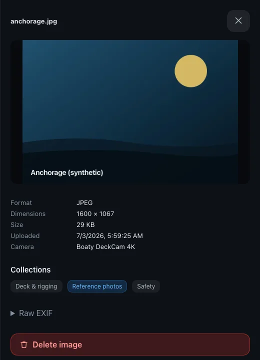

# Finding images

Once you have uploaded photos, the **Library** is where you browse them. This guide covers the tools that help you find a specific image: sorting the grid, filtering by collection, and opening a tile to read its details and EXIF data.

---

## Sort

The Library toolbar has a sort control. Pick the field to sort by:

- **Name** orders images by their display name.
- **Date** orders images by time.

Use the **Ascending** / **Descending** toggle to flip the direction.

> **Note:** When you sort by **Date**, SK Image uses the photo's capture date when the original file records one in its EXIF data. If there is no capture date, it falls back to the time the image was uploaded.

---

## Filter by collection

Collection chips appear above the grid. Tap a chip to show only the images in that collection, and tap it again to clear the filter and see everything. Filtering by collection and sorting work together, so you can narrow to one collection and still reorder what is left.

See [Collections](collections.md) for how to create and manage them.

---

## Image details + EXIF

Click a tile to open its detail view.

The detail view shows:

- **Dimensions** in pixels and the file **size**.
- The **upload date** and, when available, the **capture date** from the photo.
- The **camera** make and model.
- A **GPS location** link when the photo carries coordinates.
- The raw **EXIF** fields extracted from the original file.

---

## Where to next

- [Collections](collections.md)
- [The app](the-app.md)
