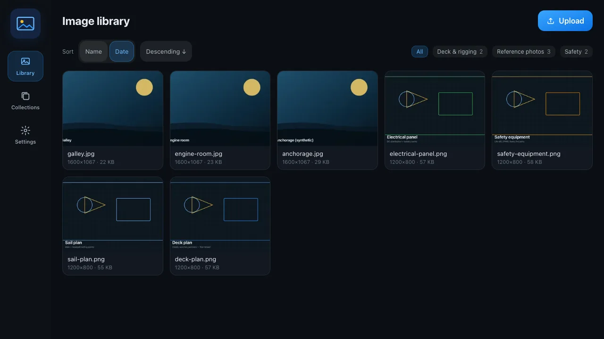
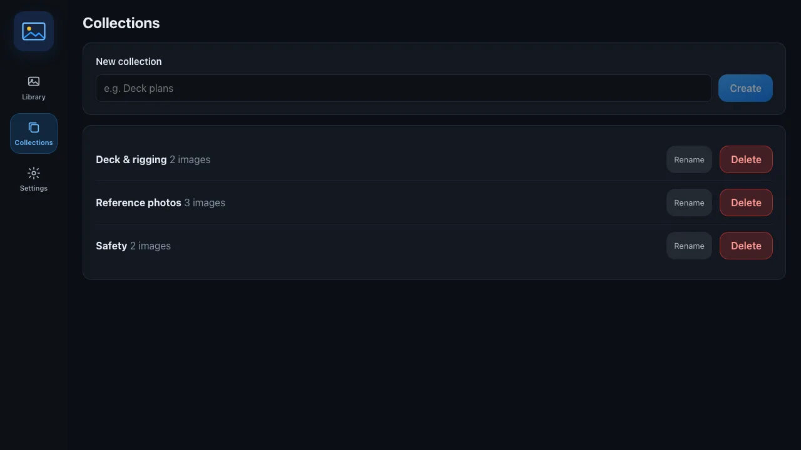
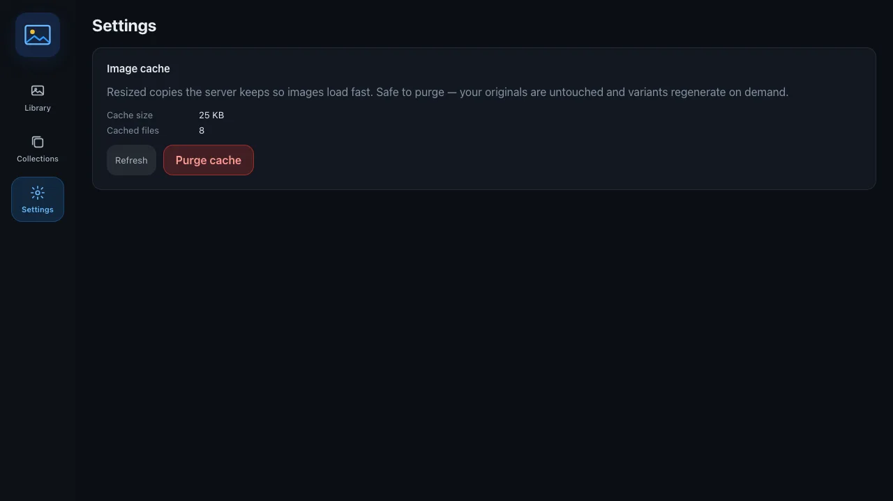

# The SK Image app

SK Image ships its own web app, served by your Signal K server at `/sk-image`. It's where you browse the shared boat image library, upload new pictures, group them into collections, and manage the on-disk cache. It works on a phone, a tablet at the helm, and a laptop at the chart table.

Open it from the Signal K admin's **Webapps** menu (**SK Image**), or go straight to `http://<your-server>:3000/sk-image`.

> **Note:** The app signs in with your existing Signal K session — there's no separate login. On an open boat server you're in straight away; on a secured server it uses your current session, and bounces you to the admin sign-in (`/admin/#/login`) if you're not already logged in.

---

## Getting around

A left rail (tablet/desktop) or bottom tab bar (phone) gives you three areas:

| Area            | What's there                                                        |
| --------------- | ------------------------------------------------------------------- |
| **Library**     | Every image as a grid of thumbnails, with upload, sort, and filter. |
| **Collections** | Named groups you create to organize the library.                    |
| **Settings**    | The image cache card — size, file count, and purge.                 |

---

## Library

**Library** is the landing view: a grid of thumbnails covering every picture in the shared library. Each tile is a WebP thumbnail generated on demand, so the grid loads quickly even on marina wifi.

Across the top you'll find the controls:

- **Upload** — add a new picture. Pick a file and it's validated and stored. See [Uploading images](uploading-images.md) for the supported formats and limits.
- **Sort** — order by name or by date, ascending or descending.
- **Collection filter** — narrow the grid to a single collection, or show everything.

Click any tile to open the **detail drawer** for that image. The drawer shows a larger preview plus everything SK Image knows about the picture:

- **EXIF** — the capture date, GPS position, camera make and model, and orientation pulled from the original file on upload, with the full raw tag set available underneath.
- **Collections** — toggle the image in or out of any collection right from the drawer.
- **Delete** — remove the image from the library for good. This needs an authenticated session when server security is on.

---

## Collections

**Collections** are named groups you build to keep the library tidy — one per trip, per boat area, or whatever suits you. This view lists every collection with a count of how many images each holds.

From here you can:

- **Create** a new collection and give it a name.
- **Rename** an existing collection.
- **Delete** a collection. This removes the grouping only; the images themselves stay in the library.

Add and remove images from a collection here, or from the toggles in an image's detail drawer. See [Organizing with collections](collections.md) for the workflow.

---

## Settings

**Settings** holds the **image cache** card. To serve pictures quickly, SK Image re-encodes each raster image to WebP at a handful of fixed widths and keeps those variants on disk. The card shows how much space that cache is using and how many files it holds.

- **Purge cache** clears the generated variants only. Your original uploads are never touched — SK Image simply regenerates each size the next time it's requested.

The cache is size-capped and evicts the least-recently-used variants on its own, so you rarely need to purge by hand. It's there for when you want to reclaim space immediately.

---

## Where to next

- [Uploading images](uploading-images.md) — supported formats, limits, and how upload works.
- [Organizing with collections](collections.md) — group and filter your library.
- [Finding images](finding-images.md) — sort, filter, and search to get to the right picture.
