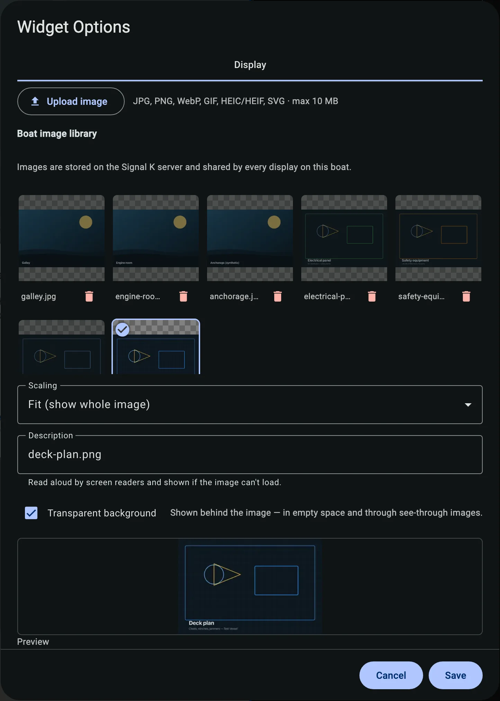

# The KIP Image widget

[KIP](https://github.com/mxtommy/Kip) is the popular Signal K dashboard. SK Image backs its **Image** widget, so any picture in your shared boat library can appear on a KIP screen.

---

## Add the widget

In KIP, edit a dashboard and add a widget, then pick **Image** from the widget list. Place and size it like any other KIP widget.

---

## Auto-install

The **Image** widget needs the `sk-image` plugin running on your Signal K server.

- If the plugin isn't installed, KIP offers to install it from the Signal K App Store. KIP waits for the install to finish, then asks to restart the server.
- If the plugin is installed but turned off, KIP offers to enable it.

> **Note:** Installing, enabling, or restarting needs an admin Signal K login. The restart briefly drops connections to the server, so expect KIP and other clients to reconnect after a moment.

---

## Pick or upload an image

Open the widget settings. Pick an image from the shared library, or upload a new one right there. The widget shows the image scaled to fit its space on the dashboard.

The library you see here is the same one the [SK Image app](the-app.md) manages — upload a picture in either place and it shows up in both.

---

## Where to next

- [Getting started](getting-started.md)
- [Uploading images](uploading-images.md)
